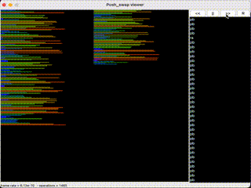

# PUSH SWAP by lajudy

###About the Task
TODO: Sort stack with numbers using set of spicial basic commands.
[subject.pdf](subject_push_swap.pdf) 
[checklist.pdf](subject_push_swap_checklist.pdf)

    LIMITATIONS: 
    Norminette rules (each function not more then 25 lines, 
    not more then 4 arguments passing, no ternary operators, 
    one line = one command, etc.)
    Not more then 12 turns for 5 numbers
    Not more then 700 turns for 100 numbers
    Not more then 5500 turns for 500 numbers

### Algorithm: scoring with both rotate optimization
* find minimum maximum and mediane of stack A
* put all the rest elements to stack B
* step-by-step moving back to stack A element with the best score
* each step recompute scores for each element

### How to use
Clone project to a directory then do 

`$>make` to build _push_swap_ binary `./push_swap 5 3 2 1 4`
 
`$>make bonus` to build _checker_

### Algorithm indicators (500-tests-mean)

	5 numbers:	9,3

	100 numbers:	571,66

	500 numbers:	5155,71

### Visualisation of the algoritm

### Links
- [My youtube lecture](https://www.youtube.com/watch?v=KeDXVukgd9g) about _scoring with reverse rotate optimization_ algorithm (russian);
- [Lecture from @acami and @wdawna](https://www.youtube.com/watch?v=xp4DUxGUggU) about push swap with scoring (russian);
- [Japanese guy lecture](https://www.youtube.com/watch?v=7KW59UO55TQ) with stack half-splitting (english)
- [Good tester by lmalki](https://github.com/lmalki-h/push_swap_tester)
- [push_swap_visualizer](https://github.com/o-reo/push_swap_visualizer) by o-reo
